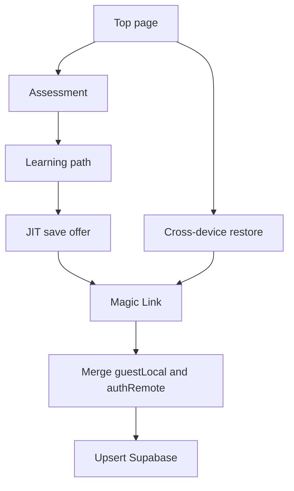
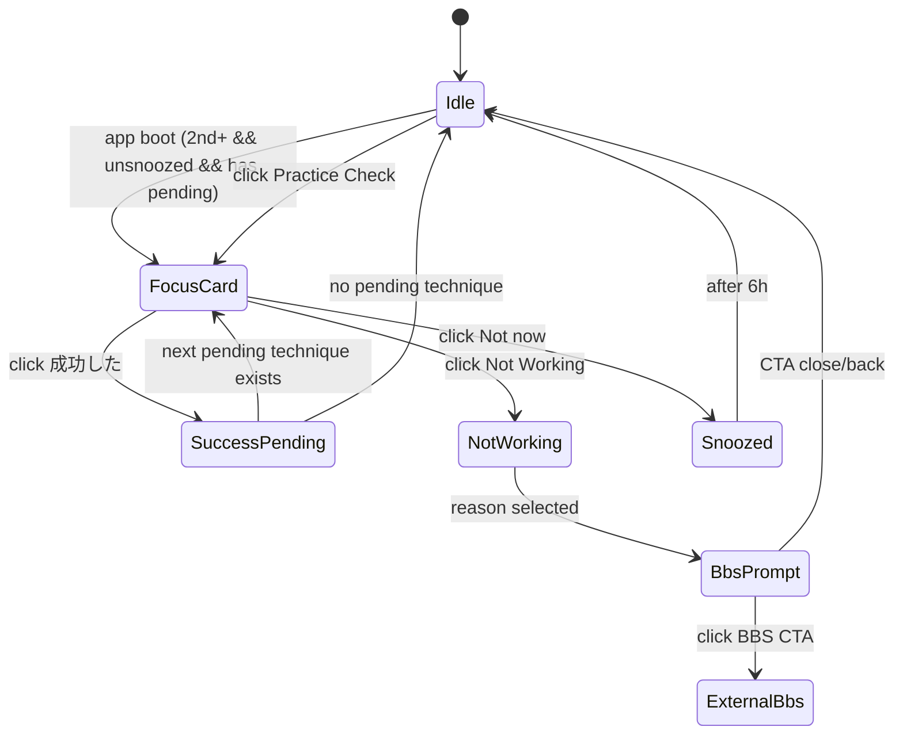

# Gatame Learning Pass 仕様書

> **本書の範囲:** 診断設問（§1）、学習パス生成（§2〜9）、**ログイン・同期**（§10）。  
> **製品要約:** `README.md` §4 / §8。ファイル索引: `PROJECT_FILE_MEMO.md`。

---

## 1. 診断設問（Assessment Wizard）

UI 文言の **正** は英語（プロフェッショナル・道場トーン）。実装: `frontend/src/locales/en.json`（`assessment` / `painPoints`）、`frontend/src/components/assessment/AssessmentForm.tsx`。

### 1.1 フロー分岐

| Q1 選択 | フロー | 表示する設問 |
|---------|--------|--------------|
| **Absolute Beginner** | 未経験者 | Q1 → **Q2-alt** → **Q3** → **Q4** |
| **Judo Student** / **BJJ Practitioner** | 経験者 | Q1 → **Q2** → **Q3** → **Q4** |
| **Advanced Judoka** / **Elite BJJ Roller** | 熟練者 | Q1 → **Q2** → **Q3** → **Q4** |

> **廃止:** 経験者向け旧 **Q2 興味**（Judo / BJJ / Mix）および旧 **Q5** 最終ゴール（Q3 と別 ID）— ゴールは **Q3 に統一**。

---

### 1.2 未経験者（Absolute Beginner）

#### Q1. Which profile fits you best today?（single select）

| 表示（英語） | 補足（英語） | 内部セグメント |
|--------------|--------------|----------------|
| Absolute Beginner | No martial arts experience | `NOVICE` / `未経験` |
| Judo Student | White through brown belt | `JUDO_BEGINNER` |
| BJJ Practitioner | White through blue belt | `BJJ_BEGINNER` |
| Advanced Judoka | Black belt (shodan) and above | `JUDO_ADVANCED` |
| Elite BJJ Roller | Purple belt and above | `BJJ_ADVANCED` |

#### Q2-alt. What fighting style do you aspire to?（multiple select）

| 表示（英語） | マッピングキー（参考） |
|--------------|------------------------|
| Dynamic Throws | `投げたい` / Dynamic Throws |
| Ground Control | Judo pinning and control |
| Submission Arts | Joint locks and chokes |
| Standing to Ground | Connecting takedowns to groundwork |

→ プール定義: **§7.1**

#### Q3. What is your ultimate goal for this path?（single select）

| 表示（英語） | 説明（英語） | API `finalGoal`（参考） |
|--------------|--------------|-------------------------|
| Fix Your Weakness | Solve specific technical bottlenecks in daily training | `課題解決` |
| Gatame Kosen Mastery | Pursue BBS certification and black belt | `BBS取得（黒帯を目指す）` |
| Fill the Gaps | Add missing techniques to complete your skill set | `技術補完` |
| Curriculum for Coaches | Structure and explain techniques for students | `指導参考` |

Q3 は **パス生成の抽選には使わない**（BBS 早期訴求バナー等の UX 用。§8.6 API 互換）。

#### Q4. Do you have an active Annual Membership?（single select）

| 表示（英語） | 説明 |
|--------------|------|
| Yes, I have Annual Membership | 動画ライブラリ利用可（自己申告） |
| Not yet | 未購入 — 動画 CTA はオファーへ |

- **補足（英語）:** Includes access to the +150 technique video library on Gatame Kosen Online.
- **永続化:** `localStorage` `gatame.annual-membership-access.v2`（`answered` + `hasAnnual`）。**API には送らない**。
- **既存ユーザー:** パス表示初回に **1 問モーダル**（`AnnualMembershipAskModal`）で同内容を確認。旧 `member-self-declare` / `annual-membership-purchased.v1` は **移行時 hasAnnual=true** に統合。

---

### 1.3 経験者＆熟練者（Judo Student / BJJ Practitioner / Advanced Judoka / Elite BJJ Roller）

#### Q1. Which profile fits you best today?（single select）

§1.2 Q1 と同一（5 択）。

#### Q2. What technical challenges do you want to solve?（multiple select, optional）

| 表示（英語） | シナリオ（英語） | pain ID |
|--------------|------------------|---------|
| Throw to Submission | I can't finish on the ground immediately after a throw. | `standing-flow-to-submission` |
| Pin Escapes | Opponents escape before I can establish a solid pin. | `pin-after-throw` |
| Flipping the Turtle | I can't break down or flip a turtle opponent. | `turtle-breakdown` |
| Submission Arts Mastery | I want to develop my submission techniques. | （プール統合・§7.2 参照） |
| Guard Pass & Defense | I want to retain my guard and hit sweeps. | `guard-pass-from-top`, `guard-bottom-sweep-submit` |
| Gripping Battles | I lose the gripping exchange and can't start my attacks. | `grip-fight` |

- **スキップ可:** 0 件選択でも次へ進める（プールはフォールバックまたはレベル既定で補完）。
- **Gripping 例外:** Advanced かつ **Gripping Battles** 選択時、§4 の枠ルールを Gripping 例外行に切り替える。

→ プール定義: **§7.2**

#### Q3. What is your ultimate goal for this path?（single select）

§1.2 Q3 と同一。

---

## 2. 前提定義：ユーザーレベル（生成算法）

> **実行タイミング:** ユーザーが診断を完了し「結果画面（学習パス）」へ遷移する瞬間に、サーバー（またはクライアント）で実行する。  
> **UX との関係:** 生成結果は **4 モジュール + 第 5（BBS 購入ゲート）** として UI に表示する（`README.md` §2.3）。  
> **実装状況:** `AssessmentForm.tsx` / `PathGenerationService.java` / `LearningPathService.java` で実装済み。

§1 Q1 に基づき、次の 3 レベルに正規化する（§4 枠ルール）。

| レベル | Q1 選択 |
|--------|---------|
| **Unexperienced** | Absolute Beginner |
| **Experienced** | Judo Student, BJJ Practitioner |
| **Advanced** | Advanced Judoka, Elite BJJ Roller |

---

## 3. モジュール階層（FOUNDATION / INTERMEDIATE / ADVANCED）

枠数ルール（§4）の「×N 枠」判定に使う。`backend/src/main/resources/modules.json` に基づく。

| 階層 | 判定規則 | 該当モジュール ID（18 件中） |
|------|----------|------------------------------|
| **FOUNDATION** | `category == "FOUNDATION"` | `ukemi`, `solo-newaza-workout`, `osaekomi`, `fundamental-tachi-waza` |
| **INTERMEDIATE** | `difficulty == "INTERMEDIATE"`（FOUNDATION 以外） | `kumikata-ai-yotsu`, `kumikata-kenka-yotsu`, `break-gripping-ai-yotsu`, `break-gripping-kenka-yotsu`, `kansetsu-waza`, `shime-waza`, `throwing`, `guard-pass-top`, `guard-pass-bottom`, `on-the-turtle`, `escape-from-osaekomi` |
| **ADVANCED** | `category == "TRANSITION"` | `shime-waza-transition`, `kansetsu-waza-transition`, `osaekomi-transition` |

---

## 4. 抽出・構成ルール（4 枠 + Goal 1 枠）

合計 **4 つの学習モジュール** を抽出し、**5 枠目** にレベル別 BBS 購入ゲート（Goal）を結合する。

| ユーザーレベル | 構成ルール（計 4 枠） | Goal（5 枠目） |
|----------------|----------------------|----------------|
| **Unexperienced** | **Ukemi（固定）** + FOUNDATION×1 + INTERMEDIATE×2 | **Kyukyu** 購入 |
| **Experienced** | FOUNDATION×1 + INTERMEDIATE×2 + ADVANCED×1 | **Sankyu** 購入 |
| **Advanced** | INTERMEDIATE×2 + ADVANCED×2 | **Sankyu** 購入 |
| **Advanced（Gripping 例外）** | INTERMEDIATE×3 + ADVANCED×1 | **Sankyu** 購入 |

**Gripping 例外:** Advanced かつ Q2 **Gripping Battles**（`grip-fight`）を選択した場合、上表の Advanced 行の代わりに本行を適用。

**Ukemi 固定:** Unexperienced では `ukemi` を常に 4 枠の 1 つに含め、残り 3 枠で FOUNDATION×1 + INTERMEDIATE×2 を満たす。

---

## 5. 実行フロー

診断回答確定後、次の順でパスを生成する。

```
1. プール取得
   └ 未経験: Q2-alt スタイル / 経験・熟練: Q2 課題（§7）に基づき候補モジュール ID プールを構築。
      複数選択時は和集合し、重複を除去（§6.1）。

2. フィルタリング
   └ §4 のユーザーレベルに応じ、枠ルールで許可されない階層を除外。
      例: Unexperienced では ADVANCED（Transition）をプールから除外。

3. 枠ごとのランダム抽出
   └ 各階層×枠数について、プール内候補が枠数より多い場合はランダム抽出（重複なし）。

4. 枠不足の補完（§6.2）
   └ プール内に INTERMEDIATE 等が足りない場合、カタログ全体の当該階層からランダム補完。

5. ソート（難易度順）
   └ FOUNDATION → INTERMEDIATE → ADVANCED。Unexperienced では Ukemi を最優先位置。

6. Goal 結合
   └ パス末尾（5 番目）に BBS 購入ゲート（Kyukyu / Sankyu）を追加。
      UI: `buildFourPlusOnePath`（第 5 ノードは常時操作可・いつでも購入導線）。
```

---

## 6. 実装上の注意点

### 6.1 重複排除

- Q2（課題）または Q2-alt（スタイル）で **複数項目** を選択した場合、各選択肢のマッピング先プールを **和集合** する。
- 最終的に抽出される 4 モジュールは **すべてユニーク**。

### 6.2 枠不足の解消

- マッピングプール内に必要な階層の候補が枠数に満たない場合、**カタログ全体の当該階層** からランダム補完する。

### 6.3 完了済みモジュール

- `completedModuleIds` に含まれるモジュールは、**次パス生成**および再診断時のプール・抽選から **除外** する（`PathGenerationService`）。
- フロントは診断スナップショット単位の `lifetimeMasteredIds`（localStorage + Supabase）を `completedModuleIds` として API に渡す。
- モジュール完了（Mark as Completed + フィードバック）時に、当該 ID を `lifetimeMasteredIds` へ即時 merge する。

### 6.4 ステージ完了と次パス生成

**1 ステージ** = 診断に基づく **4 テクニックモジュール + 第 5 BBS ゲート**。

| タイミング | 動作 |
|------------|------|
| 4 モジュールすべて完了 | **ステージ完了プロンプト**を表示（初回自動。`Not now` 後は同一パス構成では再表示しない） |
| 主 CTA「Generate next path」 | **再診断なし**。同一 `AssessmentRequest` + `completedModuleIds`（lifetime 習得済み）で `POST /api/assessment` を再実行し、**未完了モジュールから新 4 件**を抽選 |
| 副 CTA「Retake assessment」 | 診断ウィザードへ（目標・課題変更時）。学習パス本体はクリア、モジュール TODO/Memo は保持 |
| 次パス生成成功 | セッション完了 ID をリセット（新パス署名）。`lifetimeMasteredIds` / BBS 宣言 / TODO/Memo は保持 |
| カタログ習得済み | 主 CTA を非表示。副 CTA（再診断）のみ |

**Annual Membership プロモ:** ステージ完了プロンプト表示中は抑止。閉じた後（または次パス生成後）に従来どおり 24h クールダウン付きで表示可。

**関連ファイル:**

| ファイル | 役割 |
|----------|------|
| `frontend/src/components/skillmap/PathStageCompleteOverlay.tsx` | ステージ完了 UI |
| `frontend/src/hooks/useLearningPath.ts` | `generateNextPath()` |
| `frontend/src/utils/progressStorage.ts` | lifetime / `completedModuleIds` 構築 |
| `frontend/src/utils/pathStageCompleteStorage.ts` | プロンプト dismiss（パス署名単位） |

---

## 7. モジュール・マッピング（確定データセット）

### 7.1 【未経験者】スタイル別マッピング（Q2-alt → Pool）

| スタイル（UI） | プール（モジュール ID） |
|----------------|-------------------------|
| **Dynamic Throws** | `fundamental-tachi-waza`, `kumikata-ai-yotsu`, `kumikata-kenka-yotsu`, `break-gripping-ai-yotsu`, `throwing` |
| **Ground Control** | `solo-newaza-workout`, `osaekomi`, `guard-pass-top`, `guard-pass-bottom`, `on-the-turtle`, `escape-from-osaekomi` |
| **Submission Arts** | `solo-newaza-workout`, `kansetsu-waza`, `shime-waza`, `on-the-turtle` |
| **Standing to Ground** | `solo-newaza-workout`, `osaekomi`, `fundamental-tachi-waza`, `kumikata-ai-yotsu`, `kumikata-kenka-yotsu`, `throwing`, `guard-pass-top`, `on-the-turtle` |

### 7.2 【経験者＆熟練者】課題別マッピング（Q2 → Pool）

| 課題（UI） | pain ID | プール（モジュール ID） |
|------------|---------|-------------------------|
| **Throw to Submission** | `standing-flow-to-submission` | `fundamental-tachi-waza`, `osaekomi`, `kansetsu-waza`, `shime-waza`, `throwing`, `shime-waza-transition`, `kansetsu-waza-transition`, `osaekomi-transition` |
| **Pin Escapes** | `pin-after-throw` | `solo-newaza-workout`, `osaekomi`, `escape-from-osaekomi`, `on-the-turtle`, `shime-waza-transition`, `kansetsu-waza-transition` |
| **Flipping the Turtle** | `turtle-breakdown` | `solo-newaza-workout`, `kansetsu-waza`, `shime-waza`, `on-the-turtle`, `shime-waza-transition`, `kansetsu-waza-transition` |
| **Submission Arts Mastery** | （和集合時に §6.1） | `osaekomi`, `kansetsu-waza`, `shime-waza`, `on-the-turtle`, `shime-waza-transition`, `kansetsu-waza-transition` |
| **Guard Pass & Defense** | `guard-pass-from-top`, `guard-bottom-sweep-submit` | `solo-newaza-workout`, `kansetsu-waza`, `guard-pass-top`, `guard-pass-bottom`, `shime-waza-transition`, `kansetsu-waza-transition` |
| **Gripping Battles** | `grip-fight` | `fundamental-tachi-waza`, `kumikata-ai-yotsu`, `kumikata-kenka-yotsu`, `break-gripping-ai-yotsu`, `break-gripping-kenka-yotsu`, `osaekomi-transition` |

---

## 8. 関連ファイル（実装契約）

| ファイル | 役割 |
|----------|------|
| `specification.md` | 本書。診断（§1）・学習パス生成（§2〜7）・ログイン・同期（§10） |
| `README.md` §4.1, §4.4, §7, §8 | 製品機能・認証・算法・永続化要約 |
| `frontend/src/locales/en.json` | 診断 UI 文言 |
| `frontend/src/locales/painPoints.ts` | Q2 課題 ID 一覧 |
| `frontend/src/components/assessment/AssessmentForm.tsx` | 診断ウィザード（Q4 Annual Membership 含む） |
| `frontend/src/utils/annualMembershipAccess.ts` | Annual 購入状態（v2 localStorage） |
| `frontend/src/components/membership/MembershipOfferSheet.tsx` | Annual オファー（ハイブリッド C） |
| `frontend/src/components/skillmap/PathStepNode.tsx` | 学習パス モジュールノード（§12 円アイコン） |
| `frontend/src/constants/moduleCircleImages.ts` | モジュール ID → `image/` 円サムネイル |
| `backend/src/main/resources/modules.json` | モジュール定義 |
| `backend/.../LearningPathService.java` | 診断 API・パス生成 |
| `frontend/src/api/streetPathWithBbs.ts` | UI 側 4+1 表示 |
| `frontend/src/components/skillmap/PathStageCompleteOverlay.tsx` | ステージ完了 → 次パス生成 UI（§6.4） |
| `frontend/src/hooks/useLearningPath.ts` | `generate` / `generateNextPath` |
| `frontend/src/App.tsx` | ルーティング・トップゲートウェイ（§10.6） |
| `frontend/src/components/TopPage.tsx` | トップ（判断・振り分け）— 実装時追加 |
| `frontend/src/sync/` | LocalStorage + Supabase 同期アウトボックス |
| `frontend/src/components/auth/AccessPage.tsx` | 別デバイス復元・Magic Link（§10.5） |

---

## 9. 旧仕様（廃止）

- 経験者向け **Q2 興味**（JUDO / BJJ / MIX）ステップ
- **Q5** 最終ゴール（Q3 に統合）
- 全 18 モジュール **重み和スコアリング** のみで上位 4 件を選ぶ方式
- Pass 8 件 ＋ 途中 BBS マイルストーン挿入
- **未認証 Lookup 先行復元**（メールリンク待ちなしの部分復元）— §10.5 の Magic Link 必須に置換
- **診断途中の永続化**（ウィザード離脱時の `diagnosis_data` 保存）
- **診断前ログイン必須**（未ログインを `/access` のみに限定する設計）

旧 Scoring Spec の詳細は git 履歴を参照。

---

## 10. ログイン・同期（決定仕様）

> **方針:** 「ログインしないと使えない」という壁を排除し、**保存・同期したい** タイミングで初めて認証を促す（Just-in-Time）。  
> **実装状況:** 本節どおり実装済み（`TopPage.tsx`、Guest `localStorage`、`/access` Magic Link、JIT 同期バナー）。Supabase 初回セットアップは §10.12 末尾参照。

### 10.1 戦略概要

| 柱 | 内容 |
|----|------|
| **Guest 優先** | 初回訪問ではログイン不要。診断完了後に学習パスを即表示 |
| **Just-in-Time（JIT）** | クラウド保存・別デバイス復元は、ユーザーの能動的操作後に開始 |
| **同一デバイス** | `localStorage` で即「続きから」（パス・進捗・Memo・TODO 含む） |
| **別デバイス** | **Magic Link 認証後のみ** フル復元（未認証 Lookup は行わない） |
| **Kajabi** | **Redirect（リンク）方式** — API 連携なし |

```
[初回訪問]
  └ トップ → 診断を始める → 診断完了 → 学習パス生成 → localStorage に保存

[同一デバイス再訪問]
  └ トップ → 前回の診断から再開 → localStorage から即表示

[別デバイス]
  └ トップ → 別デバイスから復元 → メール入力 → Magic Link → 認証後 Supabase からフル復元

[Guest がクラウド保存したい]
  └ 学習パス上「進捗を保存（同期）」→ メール + Magic Link → Member 化 → Supabase が正本
```

### 10.2 データの正本（Guest / Member）

| 状態 | 正本 | 備考 |
|------|------|------|
| **Guest（未同期）** | 当該端末の `localStorage` | ブラウザデータ削除・別端末では消える／見えない |
| **Member（同期済み）** | **Supabase**（JWT + RLS） | 別デバイス・再インストール後も継続 |
| **Member の同一端末** | Supabase ＋ local をキャッシュ | 読み取りは Supabase（新しい方）優先（`README.md` §8.1） |

`localStorage` は **快適さ・オフライン** 用。永続化・クロスデバイスは **Supabase への同期後** とする。

### 10.3 診断と保存のタイミング

| タイミング | 永続化 |
|------------|--------|
| **診断ウィザード途中で離脱** | **保存しない**（メモリ上のみ。トップは「診断を始める」） |
| **診断完了 + 学習パス生成成功**（`POST /api/assessment` 後） | **初めて** `localStorage` に保存（Guest キー例: `guest:<deviceId>`） |
| **Member 同期完了後** | 同上データを Supabase に upsert。以降は Supabase が正本 |

判定キーは `diagnosis_data` の有無ではなく、**学習パス確定済みオブジェクト**（例: `gatame.saved-learning-path.v1:guest:<deviceId>`）の有無とする。

### 10.4 Just-in-Time（同期の促し方）

| タイミング | UI |
|------------|-----|
| **学習パス（Guest・未同期）** | バナー / ボタン「進捗を保存（同期）」→ メール + Magic Link |
| **学習パス（Member）** | 動画視聴等 → 該当 Kajabi ページへのリンク |
| **（任意）設定・プロフィール** | 手動同期・再送信 |

診断 **前** にログイン壁は置かない。

### 10.5 別デバイス復元（Magic Link 必須）

**決定:** メール所有確認前の部分復元（未認証 Lookup）は **採用しない**。別デバイスでは **Magic Link を開いてから** 学習パス・Memo・TODO を含む **フルデータ** を Supabase（RLS）から読み込む。

```
1. トップ「別のデバイスで診断済みの方は、こちらから復元」
2. メール入力（モーダルまたは /access）
3. Magic Link 送信（Supabase Auth OTP）
4. ユーザーがメール内リンクを開く → JWT 確立
5. Supabase から進捗をロード → 学習パス（Dashboard）へ
```

- リンク待ちの間は「メールをご確認ください」等の案内のみ。**パス中心の先行表示はしない。**
- Magic Link 送信レート制限: email あたり **3 回 / 15 分**（目安）。UI に cooldown を表示。

### 10.6 トップページ（ゲートウェイ）

トップ（`/`）は **判断と振り分け** の入口。診断・学習パス本体は `/diagnostic` 等に委譲する。

| ユーザー状態 | 主 CTA | 遷移先 |
|--------------|--------|--------|
| **初回 / パス未保存** | 診断を始める | 診断画面 |
| **同一デバイス再訪問**（パス生成済み・Guest） | 前回の診断から再開 | 学習パス |
| **Member**（Supabase にデータ・セッションあり） | **続きから始める** | 学習パス（Supabase から hydrate） |
| **別デバイス**（ページ下部・控えめ） | 別のデバイスで診断済みの方は、こちらから復元 | メール入力 → §10.5（Magic Link 必須） |

**分岐ロジック（概念）:**

```javascript
if (session && remoteHasPath) {
  renderPrimaryCta("続きから始める"); // Member
} else if (localPathReady) {
  renderPrimaryCta("前回の診断から再開");
} else {
  renderPrimaryCta("診断を始める");
}
// 常に footer: 別デバイスから復元 → Magic Link フロー
```

`localPathReady` = 診断完了かつ学習パス生成済みの保存オブジェクトが存在すること（途中離脱は含まない）。

### 10.7 画面遷移

| 画面 | 責務 | 永続化 | 次の遷移 |
|------|------|--------|----------|
| **トップ** | 状態に応じた CTA 振り分け | — | 診断 / 学習パス / 復元モーダル |
| **診断** | 質問 UI。完了まで **保存しない** | 完了時のみ §10.3 | 学習パス（生成成功時） |
| **学習パス** | 4+1 パス・進捗・Memo・TODO | Guest: local。Member: local + Supabase | Kajabi / 同期モーダル |
| **同期モーダル** | メール入力・Magic Link 送信 | JWT 後 Supabase | 学習パス |
| **/access** | Kajabi `?email=` 導線・Magic Link | 同上 | 認証後 `/diagnostic` |

### 10.8 Guest → Member 初回マージ

Magic Link で JWT 確立後、**同一端末の guestLocal** と **authRemote（Supabase）** をマージしてから upsert する。

| データ | ルール |
|--------|--------|
| **学習パス** | `assessmentFingerprint` 同一 → `savedAt` が新しい方を代表。進捗量で tie-break。fingerprint 異なる → ユーザーに「この端末のパス」/「クラウドのパス」を選択させる（自動上書きしない） |
| **完了状態** | `sessionCompletedIds` / `lifetimeMasteredIds` / `bbsDeclaredMasteredLevels` は **union** |
| **TODO** | 同一 itemId は **`true` 優先（OR）** |
| **Memo** | 片方空 → 非空採用。両方非空かつ異なる → **`updatedAt` が新しい方**。負け側は `gatame.sync-conflicts.v1:<userId>` に退避可 |

**書き込み順序:**

```
1. Magic Link → JWT 確立
2. authRemote を RLS で load（フルデータ）
3. guestLocal と authRemote を上記ルールでマージ
4. マージ結果を Supabase へ upsert
5. Guest outbox（guest:<deviceId>）を userId に re-key → flushSyncQueue
6. local キャッシュを更新
```



- Guest 中の未送信操作: `gatame.sync-outbox.v1:guest:<deviceId>`。認証後に `userId` へ re-key。
- 各ローカルレコードに `updatedAt`（epoch ms）を付与（Memo 競合用）。

### 10.9 セキュリティ・Kajabi

- 進捗テーブルは RLS（`auth.uid() = user_id`）。フロントは anon key + JWT。
- フロントから email で `user_learning_paths` 等を **直接検索しない**。
- 未認証中の **Supabase への upsert 禁止**。
- Magic Link 乱用対策: 送信レート制限・均一な成功文言（「登録されていません」等で存在を示さない）。
- **Kajabi:** `?email=` 付き `/access` へ Redirect。`{{member.email}}` 未展開時は手入力。詳細は `README.md` §9。

### 10.10 決定事項サマリー

| 項目 | 決定内容 |
|------|----------|
| **入口** | トップページで状態別 CTA（§10.6） |
| **Guest** | ログイン不要。パス生成後のみ local 保存 |
| **同一デバイス** | localStorage で即再開（フル） |
| **別デバイス** | **Magic Link 必須**。未認証 Lookup **なし** |
| **Member** | Supabase が正本。トップ CTA「続きから始める」 |
| **同期タイミング** | JIT（学習パス上の保存オファー等） |
| **Kajabi** | Redirect のみ |

### 10.11 実装契約・関連ファイル

| ファイル | 役割 |
|----------|------|
| `frontend/src/components/TopPage.tsx` | トップゲートウェイ（§10.6）— 新規 |
| `frontend/src/App.tsx` | `/` = トップ。Guest で `/diagnostic` 到達可能に |
| `frontend/src/NavigatorApp.tsx` | 診断・学習パス |
| `frontend/src/components/assessment/AssessmentForm.tsx` | 診断（完了時のみ persist トリガ） |
| `frontend/src/hooks/useLearningPath.ts` | local / Supabase hydrate・マージ |
| `frontend/src/utils/learningPathPersistence.ts` | `guest:<deviceId>` キー |
| `frontend/src/sync/syncService.ts` | 認証後 flush・outbox re-key |
| `frontend/src/api/supabaseProgressApi.ts` | RLS 経由の load / save |
| `frontend/src/components/auth/AccessPage.tsx` | 別デバイス・Kajabi・Magic Link |
| `supabase/migrations/001_user_progress.sql` | 進捗テーブル（RLS） |

### 10.12 実装状況

| 項目 | 状態 |
|------|------|
| `/` トップ + Guest で診断・パス | **実装済み** |
| パス生成後のみ local 保存・同期促進 | **実装済み** |
| 別デバイス Magic Link のみ（Lookup 廃止） | **実装済み** |
| `SyncProvider` + 認証後マージ | **実装済み** |
| fingerprint 不一致時の UI 選択 | **未実装**（§10.8 — 現状は新しい方採用の簡易マージ） |

### 10.13 Supabase 側のセットアップ（運用者向け）

1. **SQL マイグレーション** — Dashboard → SQL Editor で `supabase/migrations/001_user_progress.sql` を実行（未実施の場合）。
2. **Authentication → URL Configuration**
   - **Site URL:** `https://gatame-kosen-learning-pass-navigato.vercel.app`（または本番ドメイン）
   - **Redirect URLs に追加:**
     - `https://gatame-kosen-learning-pass-navigato.vercel.app/diagnostic`
     - `http://localhost:5173/diagnostic`（ローカル開発）
3. **Email テンプレート** — Magic Link（OTP）が有効であること。
4. **環境変数（Vercel / `frontend/.env`）**
   - `VITE_SUPABASE_URL`
   - `VITE_SUPABASE_ANON_KEY`
5. **（任意）Email レート制限** — Supabase Auth の組み込み制限に加え、アプリ側で 3 回 / 15 分（`SyncSaveModal` / `AccessPage`）を実装済み。

未認証 Lookup 用の Edge Function・`003_user_sync_lookup_index` は **不要**（別デバイスは Magic Link のみ）。

### 10.14 Annual Membership・Bottom Bar・動画 CTA

**3 概念を分離する:**

| 概念 | 用途 |
|------|------|
| **Annual Membership**（Q4 / 1 問モーダル） | 動画ライブラリ・オファー分岐 |
| **Gatame Kosen Online ログイン**（Kajabi） | 購入済みユーザーの動画視聴 |
| **GATAME アプリログイン**（Supabase） | Save progress / Profile / Cloud sync |

**`hasAnnual === true`（購入済み自己申告）**

| UI | ラベル / 動作 |
|----|----------------|
| Bottom Bar 中央 | **Videos** → Kajabi ログイン（`https://www.kosenjudoonline.com/login`） |
| ドロワー下部 | **Watch Video** → 同上 |
| Profile 右端 | Supabase ログイン済みなら **Profile**（Annual No でも同様） |

**`hasAnnual === false`**

| UI | ラベル / 動作 |
|----|----------------|
| Bottom Bar 中央 | **Membership** → `MembershipOfferSheet`（案 C ハイブリッド） |
| ドロワー下部 | **Get Membership** → 同上 |
| オファー Primary | **View plans** → [Annual checkout](https://www.kosenjudoonline.com/offers/RsoV92Tp/checkout) |
| オファー Secondary | **I already have Annual Membership** → `hasAnnual=true` + Kajabi ログイン |

**関連ファイル:** `annualMembershipAccess.ts`, `MembershipAccessContext.tsx`, `MembershipOfferSheet.tsx`, `AnnualMembershipAskModal.tsx`, `AppBottomBar.tsx`, `ReferenceVideoAccessPromo.tsx`.

---

## 11. 練習前後の確認カード（Confirm Card）

### 11.1 目的

- **Focus（練習前）**: 当日の未完了技 1 件に対して 3 つの意識ポイントを提示し、練習時の注意を一点集中させる。
- **Triage（練習後）**: 結果を 3 択で記録し、躓き時には BBS の客観フィードバック導線を提示する。
- **UX 最優先**: 「押し付けない」「次の一歩が明確」「オフラインでも壊れない」を最優先原則とする。

### 11.2 トリガーと表示条件

| 項目 | ルール |
|------|--------|
| 自動表示タイミング | **2 回目以降のアプリ起動時（session 有無を問わない）** |
| 再表示抑制 | 最後に **Not now** を押してから **6 時間** は自動再表示しない |
| 対象技 | 現在の 4 モジュール内で、**UI 表示順に走査したとき最初の未完了 technique** |
| Drawer ボタン | ラベルは **Practice Check**。未完了技がある場合のみ表示 |

補足:

- 起動時自動表示は 1 回のみ判定し、表示後は通常のダッシュボード操作を阻害しない。
- Drawer の **Practice Check** は自動表示クールダウン中でも手動起動できる。

### 11.3 カード UI とボタン動作

カード表示項目:

- Technique Name
- Focus Points（3 件）

ボタン仕様:

| ボタン | 処理ロジック | UX ゴール |
|--------|--------------|-----------|
| 成功した | local 即時更新 → outbox enqueue → 非同期 Supabase 同期 → Undo 5 秒表示 | 達成感 + 次ステップへの連続遷移 |
| Not Working | 教育文言（3 種ランダム 1 件）表示 → BBS 訴求文 + CTA 表示 | 認知の歪みを言語化し、客観指導へ導く |
| Not now | カードを閉じる + `snoozeUntil = now + 6h` | ストレスなく学習導線に戻す |

### 11.4 成功時の詳細動作

1. 対象 `techniqueId` を `completedTechniqueIds` に追加（重複不可）。
2. 対象 technique のチェックボックスを ON にし、UI に即反映。
3. 「Undo（5 秒）」を表示。Undo 時は local の変更をロールバックし、outbox には取り消しイベントを enqueue。
4. Undo がなければ次の未完了 technique を再計算し、存在する場合は **次カードを連続表示**。
5. 全 technique 完了時はカードを閉じ、通常 UI に戻る。

チェックボックス要件:

- technique 完了チェックは **いつでも手動で取り消し可能**。
- 手動トグル（ON/OFF）も outbox に enqueue し、Supabase へ eventually consistent に反映。

### 11.5 Not Working フロー

`Not Working` 選択時の表示順:

1. 「何が違いましたか？」質問と reason 選択肢（例: 力み / タイミング / 反応差分）
2. 教育文言（下記 3 つからランダム表示）
3. BBS 訴求文
4. CTA「BBSプランを確認する」

教育文言テンプレート（ランダム）:

1. 「動画で理解できても、実際の組み手では重心と間合いのズレが起きやすいです。」
2. 「再現できない原因は、手順より先に“力の方向”がズレているケースが多いです。」
3. 「感覚の違和感は上達の入口です。ズレを言語化すると修正速度が上がります。」

BBS 訴求文（固定）:

- 「動画だけでは分からない『細部のズレ』は、客観的な視点が必要です。BBSで黒帯のフィードバックを受け、最短で解決しませんか？」

CTA 遷移先:

- **4+1 パスの 5 枠目 module の `url` を参照**して遷移する。

### 11.6 データモデル

#### 11.6.1 Technique メタデータ（カタログ）

```json
{
  "module_id": "string",
  "techniques": [
    {
      "id": "tech_001",
      "name": "Ouchi Gari",
      "focus_points": [
        "1. heel alignment",
        "2. chest pressure",
        "3. arc sweep"
      ]
    }
  ]
}
```

#### 11.6.2 ユーザー状態（短期実装）

```json
{
  "userId": "uuid-or-guest-storage-id",
  "pathFingerprint": "string",
  "checkedItemsByModule": {
    "ukemi": { "tech-0": true, "tech-1": false }
  },
  "lastPracticeCardDismissedAt": 1716861000000,
  "practiceCardSnoozeUntil": 1716882600000,
  "updatedAt": 1716861000000
}
```

備考:

- **短期（現行）**: technique 完了状態は `user_module_details.checked_items` を正として扱う。
- `completedTechniqueIds` の独立 DB 管理は中期拡張（分析要件が増えた時点）で検討する。
- `next_step_url` は固定保存せず、表示時に **5 枠目 module url を都度参照**する（リンク不整合防止）。

### 11.7 同期ルール（成功 / 手動トグル共通）

1. **Local First**: UI 操作直後に local を更新。
2. **Outbox enqueue**: 既存 `module_detail`（`checked_items`）更新をキューへ追加。
3. **Async Supabase**: オンライン時に順次 upsert。失敗時はキューを保持して再試行。
4. **Conflict 解決**: 同一 `techniqueId` は `updatedAt` が新しいイベントを優先。
5. **整合性**: `completedTechniqueIds` は最終的にサーバー・ローカルで一致するまで再送する。

### 11.8 状態遷移図



### 11.9 実装対象ファイル（契約）

| ファイル | 変更内容 |
|----------|----------|
| `frontend/src/NavigatorApp.tsx` | アプリ起動回数の記録 |
| `frontend/src/components/skillmap/VerticalPathContainer.tsx` | Drawer 内 Practice Check ボタン、カード orchestration |
| `frontend/src/components/practice/PracticeCheckCard.tsx` | Focus / Triage カード本体 |
| `frontend/src/hooks/usePracticeCheck.ts` | 対象技抽出、連続表示、snooze / 自動表示判定 |
| `frontend/src/utils/practiceCheckPersistence.ts` | 起動回数・snooze・パス生成セッション抑制 |
| `frontend/src/sync/syncOutbox.ts` | technique 完了イベント種別 |
| `frontend/src/api/supabaseProgressApi.ts` | technique 状態 upsert |

---

## 12. 学習パス モジュール円アイコン

学習パス上の各モジュールノード（`PathStepNode`）の **円内サムネイル** は、リポジトリ直下 `image/` の静的アセットを **モジュール ID で引く**。API の `thumbnailUrl`（プレースホルダー）は **ローカル画像が無い場合のみ** フォールバック。

**配置:** `image/`（Vite alias `@image` — `frontend/vite.config.ts` / `frontend/tsconfig.json`）

**実装:** `frontend/src/constants/moduleCircleImages.ts` → `getModuleCircleImageSrc(moduleId)`  
**表示:** `frontend/src/components/skillmap/PathStepNode.tsx` の `ModuleThumbCircle`

**フォールバック順:** ① `MODULE_CIRCLE_IMAGE_BY_ID[moduleId]` → ② `module.thumbnailUrl` → ③ モジュール名先頭 1 文字

**表示調整:** 共通 `MODULE_CIRCLE_IMAGE_SCALE`（1.30）。**Ukemi** / **escape-from-osaekomi** のみ `MODULE_CIRCLE_CONTENT_ANCHOR_BY_ID`（写真中心 %）→ `contentAnchorToObjectPosition()` で cover 用 `object-position` に変換。

### 12.1 モジュール ID ↔ 画像ファイル

#### 初級（BEGINNER）— FOUNDATION — 4 件

| モジュール | module ID | 画像ファイル |
|------------|-----------|--------------|
| Ukemi | `ukemi` | `Ukemi.webp` |
| Solo Newaza Workout | `solo-newaza-workout` | `Solo Newaza workout_Circle.webp` |
| Osaekomi | `osaekomi` | `Osae-komi_Circle.webp` |
| Fundamental Tachi-waza | `fundamental-tachi-waza` | `Fundmental Tachi-waza_Circle.webp` |

#### 中級（INTERMEDIATE）— 11 件

| モジュール | module ID | category | 画像ファイル |
|------------|-----------|----------|--------------|
| Kumikata — Ai-yotsu | `kumikata-ai-yotsu` | PAIRING | `Kumikata in Aiyotsu_Circle.webp` |
| Kumikata — Kenka-yotsu | `kumikata-kenka-yotsu` | PAIRING | `Kumikata in Kenkayotsu_Circle.webp` |
| Break the Gripping — Ai-yotsu | `break-gripping-ai-yotsu` | PAIRING | `Breaking the gripping in Aiyotsu_Circle.webp` |
| Break the Gripping — Kenka-yotsu | `break-gripping-kenka-yotsu` | PAIRING | `Breaking the Grip in Kenkayotsu_Circle.webp` |
| Joint Locks (Kansetsu-waza) | `kansetsu-waza` | SINGLE_TECHNIQUE | `Kansetsu-waza_Circle.webp` |
| Chokes (Shime-waza) | `shime-waza` | SINGLE_TECHNIQUE | `Shime-waza_Circle.webp` |
| Throwing | `throwing` | SINGLE_TECHNIQUE | `Throwing_Circle.webp` |
| Guard Position from Top | `guard-pass-top` | ATTACK_DEFENSE | `Guard pass on the top_Circle.webp` |
| Bottom Guard — Sweeps & Attacks | `guard-pass-bottom` | ATTACK_DEFENSE | `Guard Position on the Bottom_Circle.webp` |
| Turtle — Attack & Defense | `on-the-turtle` | ATTACK_DEFENSE | `On the turtle_Circle.webp` |
| Escape from Osaekomi | `escape-from-osaekomi` | ATTACK_DEFENSE | `Kesa-gatame escape_Circle.webp` |

#### 上級（ADVANCED）— TRANSITION — 3 件

| モジュール | module ID | 画像ファイル |
|------------|-----------|--------------|
| Choke Transitions | `shime-waza-transition` | `Transiton Shime-waza_Circle.webp` |
| Joint Lock Transitions | `kansetsu-waza-transition` | `transition Kansetsu-waza_Circle.webp` |
| Osaekomi Transitions | `osaekomi-transition` | `Transiton Osaekomi_Circle.webp` |

**備考:** BBS 第 5 ノード（`BbsPathStepNode`）の円内は級別画像を使用。Kyukyu / Sankyu 以外はベルトロゴ（`bbsAssets.ts`）にフォールバック。

### 12.2 BBS 級別 画像（Kyukyu / Sankyu）

| 用途 | 級 | BbsLevelKey | 画像ファイル |
|------|----|-------------|--------------|
| 円サムネイル | 九級 | `Kyukyu` | `Kyukyu-image_Circle.webp` |
| 円サムネイル | 三級 | `Sankyu` | `Sankyu-image_Circle.webp` |
| premium カード背景 | 九級 | `Kyukyu` | `Kyukyu-image.webp` |
| premium カード背景 | 三級 | `Sankyu` | `Sankyu-image.webp` |

**実装:** `frontend/src/constants/bbsAssets.ts`  
- 円: `getBbsLevelCircleImageSrc(level)` → `BbsLevelCircleImage.tsx`  
- カード背景: `getBbsLevelCardBackgroundSrc(level)` → `BbsPathStepNode`（`.bbs-path-premium-card`）
